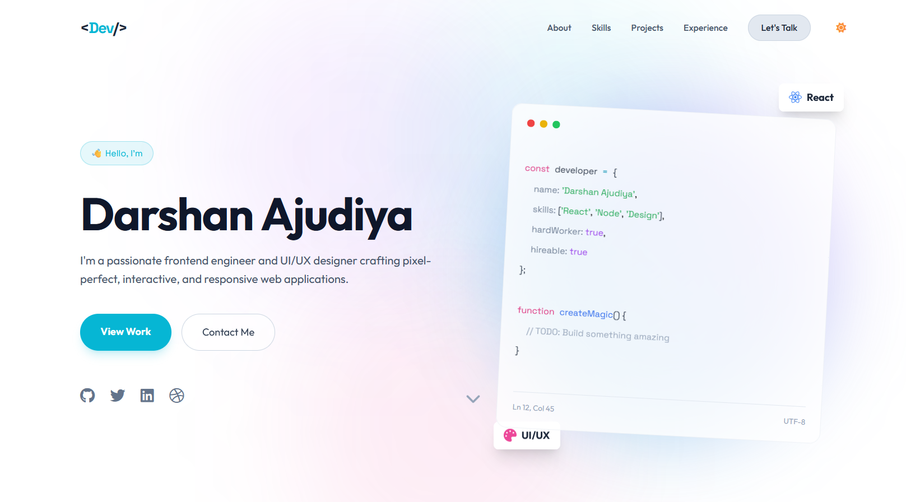

# DevPortfolio | Darshan Ajudiya

A sophisticated, high-performance personal portfolio website designed for developers. Built with modern web technologies, it features a glassmorphic UI, dynamic animations, and a fully responsive layout.



## 🚀 Experience it Live
Check out the live demo here: [Darshan.Dev](file:///e:/Darshan's%20Profile/profile/index.html) *(Local Path)*

## ✨ Key Features

-   **Glassmorphic Design**: Modern aesthetic using backdrop blurs and subtle gradients.
-   **Dynamic Animations**: Powered by **GSAP** and **ScrollTrigger** for smooth entrance effects and interactive elements.
-   **Responsive Layout**: Fully optimized for mobile, tablet, and desktop screens using **Tailwind CSS**.
-   **Particle Background**: A custom lightweight particle system for an immersive background experience.
-   **Performance Focused**: Minimal dependencies and optimized assets for near-instant load times.
-   **Themed Components**:
    -   Interactive Hero Section with floating 3D-like badges.
    -   Education Timeline with progress tracking.
    -   Project Showcase with hover-reveal effects.
    -   Skills Marquee for smooth technical stack presentation.
    -   Contact Form with modern input styling.

## 🛠️ Tech Stack

-   **Core**: HTML5, Vanilla JavaScript
-   **Styling**: [Tailwind CSS](https://tailwindcss.com/) (Play CDN)
-   **Animations**: [GSAP](https://greensock.com/gsap/) (GreenSock Animation Platform)
-   **Icons**: [FontAwesome 6](https://fontawesome.com/)
-   **Typography**: [Google Fonts](https://fonts.google.com/) (Outfit & Space Grotesk)

## 📁 Project Structure

```text
├── index.html          # Main entry point & Styling
├── profile.jpeg        # Profile picture
├── project1.jpeg       # Project screenshots
├── project2.png
├── project3.png
├── resume.pdf          # Professional Resume
└── README.md           # Documentation
```

## 🛠️ Installation & Setup

Since this is a client-side project utilizing CDNs for Tailwind and GSAP, no complex installation is required.

1.  **Clone the repository**:
    ```bash
    git clone https://github.com/DarshanAjudiya7/profile.git
    cd profile
    ```
2.  **Open in Browser**:
    Simply open `index.html` in any modern web browser or use a "Live Server" extension in VS Code for the best experience.

## 📧 Contact

**Darshan Ajudiya**
-   **Email**: [darshanajudiya07@gmail.com](mailto:darshanajudiya07@gmail.com)
-   **GitHub**: [@DarshanAjudiya7](https://github.com/DarshanAjudiya7)
-   **LinkedIn**: [Darshan Ajudiya](https://www.linkedin.com/in/darshan-ajudiya-a5b301310/)
-   **Twitter**: [@AjudiyaDarshan7](https://x.com/AjudiyaDarshan7)

---
*Created with ❤️ by Darshan Ajudiya*
